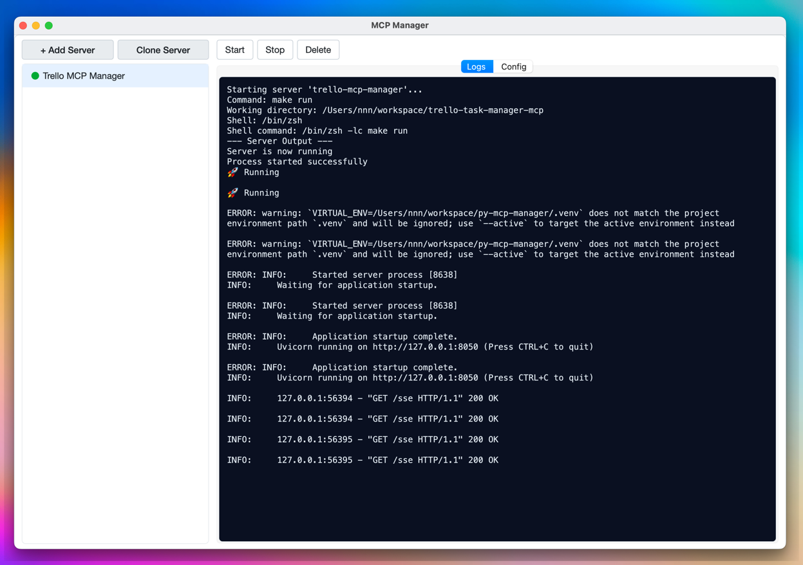

# MCP Manager

A desktop application for managing Model Context Protocol (MCP) servers with a graphical interface.



## Overview

MCP Manager simplifies the process of configuring, starting, stopping, and monitoring multiple MCP servers from a single interface.

## Installation

### Prerequisites

- Python 3.11 or higher
- [uv](https://github.com/astral-sh/uv) (recommended for dependency management)

### Using uv (recommended)

```bash
# Clone the repository
git clone https://github.com/metimol/py-mcp-manager.git
cd py-mcp-manager

# Install dependencies
make install

# Run the application
make run
```

To create a standalone executable:

```bash
# Create macOS .app bundle
make package

# Install to Applications folder
make install-macosx
```

### Using Docker

You can also run MCP Manager using Docker:

```bash
# Pull the latest image from GitHub Container Registry
docker pull ghcr.io/metimol/py-mcp-manager:latest

# Run with X11 forwarding (Linux)
docker run -it --rm \
  -e DISPLAY=$DISPLAY \
  -v /tmp/.X11-unix:/tmp/.X11-unix:rw \
  -v $HOME/.Xauthority:/home/app/.Xauthority:ro \
  ghcr.io/metimol/py-mcp-manager:latest

# Run with X11 forwarding (macOS with XQuartz)
# First install XQuartz and run: xhost +localhost
docker run -it --rm \
  -e DISPLAY=host.docker.internal:0 \
  ghcr.io/metimol/py-mcp-manager:latest
```

**Build from source:**

```bash
# Build the Docker image
docker build -t py-mcp-manager .

# Run the locally built image
docker run -it --rm \
  -e DISPLAY=$DISPLAY \
  -v /tmp/.X11-unix:/tmp/.X11-unix:rw \
  py-mcp-manager
```

**Note:** Running GUI applications in Docker requires X11 forwarding or similar display mechanisms. The exact setup depends on your host operating system.

**For headless environments:**

If you're running in a headless environment (no display server), you have several options:

```bash
# Option 1: Use offscreen mode (no visible GUI, but app runs)
docker run -it --rm \
  -e QT_QPA_PLATFORM=offscreen \
  ghcr.io/metimol/py-mcp-manager:latest

# Option 2: Use Xvfb virtual display
docker run -it --rm \
  ghcr.io/metimol/py-mcp-manager:latest \
  bash -c "xvfb-run -a python mcp_manager.py"
```

## Usage

1. Launch the application using one of the methods above
2. Click "+ Add Server" to create your first server configuration
3. Fill in the server details:
   - Server ID (unique identifier)
   - Display Name
   - Command to run the server
   - Arguments
   - Environment variables
   - Working directory
4. Click "Save"
5. Use the "Start" button to launch your server
6. Monitor logs and status in real-time

## Configuration

Server configurations are stored in a platform-appropriate user data directory:

- **macOS**: `~/Library/Application Support/MCP Manager/mcp_servers.json`
- **Windows**: `%APPDATA%\MCP Manager\mcp_servers.json`
- **Linux**: `~/.local/share/mcp-manager/mcp_servers.json`

You can:

- Manually edit this file when the application is not running
- Use the built-in JSON editor (View JSON button)
- Import/export configurations using the JSON import/export features

## License

This project is licensed under the MIT License - see the LICENSE file for details.

## Troubleshooting

### Headless Environment Issues

If you encounter errors like:
- `qt.qpa.xcb: could not connect to display :0`
- `ImportError: libEGL.so.1: cannot open shared object file`
- `Could not load the Qt platform plugin "xcb"`

This means you're running in a headless environment without a display server. Solutions:

1. **Use offscreen mode** (recommended for headless):
   ```bash
   QT_QPA_PLATFORM=offscreen python mcp_manager_launcher.py
   ```

2. **Use Xvfb virtual display**:
   ```bash
   xvfb-run -a python mcp_manager_launcher.py
   ```

3. **Set up X11 forwarding** (if using SSH):
   ```bash
   ssh -X your-server
   ```

4. **In Docker**, use the appropriate environment variables:
   ```bash
   # For offscreen mode
   docker run -e QT_QPA_PLATFORM=offscreen your-image
   
   # For X11 forwarding
   docker run -e DISPLAY=$DISPLAY -v /tmp/.X11-unix:/tmp/.X11-unix:rw your-image
   ```

The application will automatically detect headless environments and provide helpful error messages with solutions.
